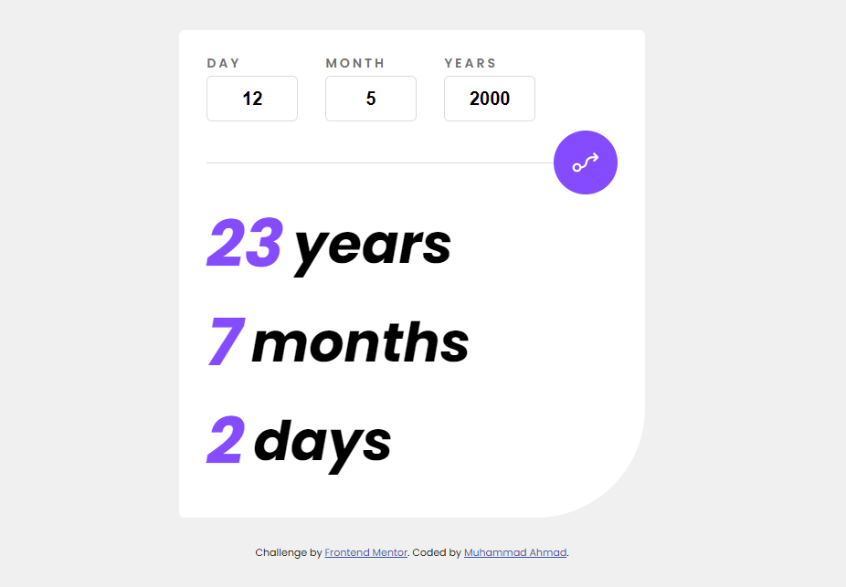
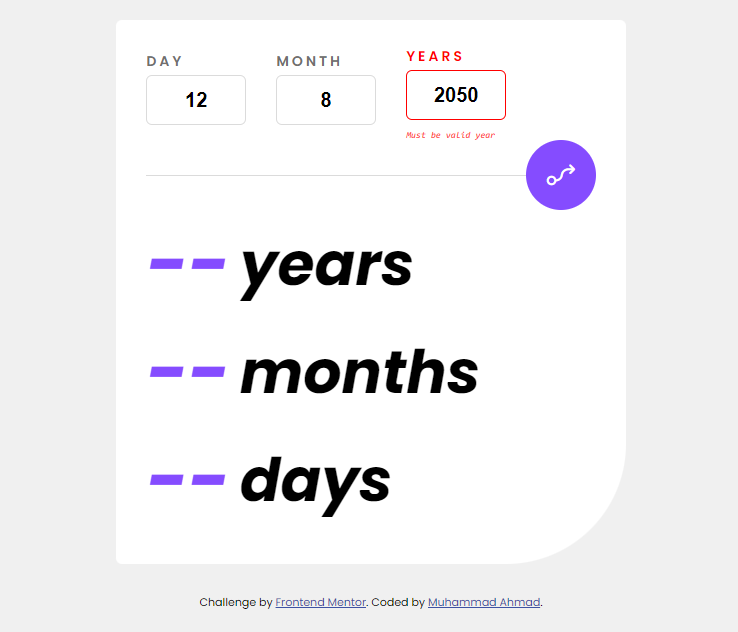

# Frontend Mentor - Age calculator app solution

This is a solution to the [Age calculator app challenge on Frontend Mentor](https://www.frontendmentor.io/challenges/age-calculator-app-dF9DFFpj-Q).

## Table of contents

**Note: Delete this note and update the table of contents based on what sections you keep.**

### The challenge

Users should be able to:

### Screenshot

### Links

- Solution URL: [Add solution URL here](https://your-solution-url.com)
- Live Site URL: [Add live site URL here](https://age-calculator-aap.surge.sh/)

### Built with

- Semantic HTML5 markup
- CSS custom properties
- Flexbox
- Desktop-first workflow
- JavaScript

## Author

- Frontend Mentor - [@muhammad-ahmad66](https://www.frontendmentor.io/profile/muhammad-ahmad66)
